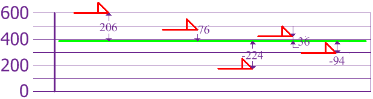
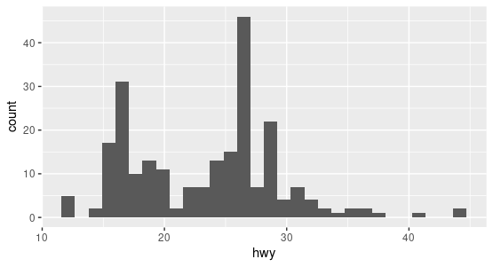
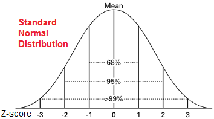
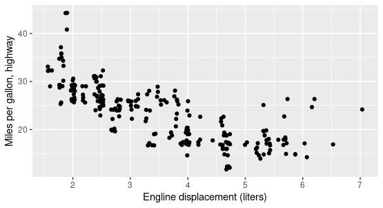
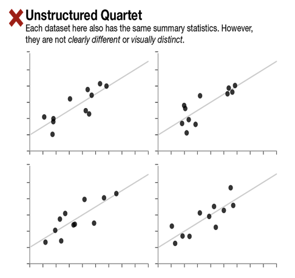
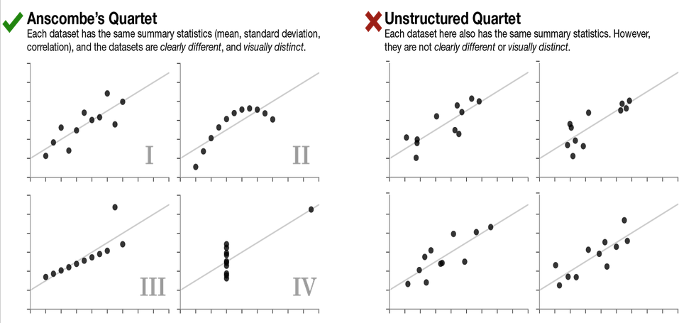

% Exploratory Data Analysis
% DA 101, Dr. Ladd
% Week 5

# *Look* at the Data

## John Tukey (1962)


## Exploratory Data Analysis is focused on the **location**, **variability**, and **distribution** of data.

# Location: What is the data's "typical value"?

## Let's imagine a variable showing the heights of different dogs.


## Mean is the sum of all values divided by the number of values.

AKA "average"


$\dfrac{600+470+170+430+300}{5} = 394$

## We can calculate the mean easily in R.

```r
dogs <- c(600, 470, 170, 430, 300) # Put the dog heights into a vector

mean(dogs) # Calculate the mean
```

## Median is the value such that half of the data lies above and below.

AKA "50th percentile"


```r
median(dogs)
```

## Percentile is a value such that *P* percent of the data lies below.

AKA "quantile"

## The 25th Percentile is the 1st Quartile.


```r
summary(dogs)
```

## The 75th Percentile is the 3rd Quartile.


```r
summary(dogs)
```

## The median is the 2nd Quartile!!

## An **outlier** is a data value that's different from most of the data.

AKA "extreme value"

## A **robust** variable is not sensitive to extreme values.

# Variability: Is the data tightly clustered or spread out?

## The **interquartile range** is the difference between the 1st and 3rd quartiles.

```r
IQR(dogs)
```

## A **deviation** is the difference between an actual value and an estimate of location (like the mean).



## The **variance** is the sum of the squared deviations, divided by the number of values.


$\dfrac{206^2+76^2+(-224)^2+36^2+(-94)^2}{5} = 21,704$

## The **standard deviation** is the square root of the variance.


Rottweilers *are* tall, and dachsunds *are* short---compared to the standard deviation from the mean.

## Now calculate the variance and standard deviations in R.

```r
var(dogs)

sd(dogs)
```

Were these the results you expected?

## Population vs. Sample

When you have "N" data values:

- The Entire Population: divide by N when calculating variance (like we did)
- A Sample: divide by N-1 when calculating variance

Sample variance: $\dfrac{108,520}{4}=27,130$  
Sample standard deviation: $\sqrt{27,130}=164$

Think of it as a "correction" when your data is only a sample. R does this by default!

## Neither the mean, variance, nor standard deviation are **robust**. They are all very sensitive to outliers!

# Distributions: How many of each value are there?

## Histograms show distributions based on frequency counts.



## The normal distribution has most values in the middle.



Be careful: normal distributions are assumed for many statistical analyses!

## Boxplots show distribution based on the median.


# Correlation: Are two variables related?

## Location, Variability, and Distribution are for one variable at a time (univariate analysis). Correlation is for *two* variables (bivariate analysis).

## Let's look at `displ` and `hwy` in the `mpg` dataset



## Correlation coefficient measures the extent to which two variables are related, on a scale of -1 to 1.

Pearson's correlation coefficient multiplies the deviations from the mean for two variables, and divides by the product of the standard deviation.

```r
cor(mpg$displ,mpg$hwy)
```

# Don't be fooled!

## Always use summary statistics and visualization *together*.



## If we have the same **mean**, **standard deviation**, and **correlation** we might expect the data sets to be similar...

## But they could very clearly and visually **distinct**!



## Data Challenge

```r
install.packages(“datasauRus”)
library(datasauRus)
```

Use `dplyr` to find the summary statistics for each dataset in the `datasaurus_dozen`.

- Find mean, standard deviation, and correlation for both x and y of each dataset.
- Wrap your functions in `round()` to round to 3 decimal places.

When you're done, try making scatter plots!
