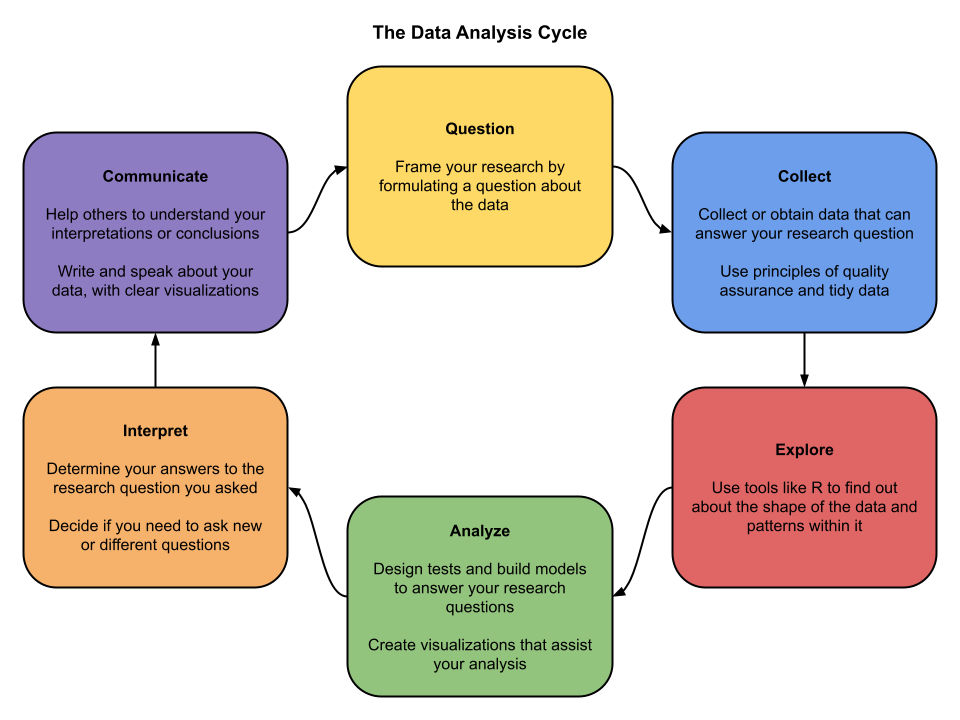

% Ethics, Bias, and Diversity in Data Analysis
% DA 101, Dr. Ladd
% Week 7

# Ethics applies to every step of the DA cycle

---

## Ethics in Data Collection and Study Design

## Ethics in Visualization and Analysis

## Ethics in Interpretation and Communication

## Ethics isn't only about human subjects!

# Principles and Standards

## **Ethical principles** are general values that guide decision making.

They are distinct from specific rules.

## **Ethical standards** are specific applications of general principles.

They are sometimes prescriptive or legally required.

## [Belmont Report Ethical Principles](https://videocast.nih.gov/pdf/ohrp_belmont_report.pdf) (1979)

- Respect for Persons
- Beneficence
- Justice

## [International Statistical Institute](https://www.isi-web.org/images/about/Declaration-EN2010.pdf) (2010)

- Respect
- Professionalism
- Truthfulness and Integrity

# Case Studies

---

You are a data scientist working as a consultant with a lobbying group for XX organization. In your first consultation meeting, the group states that they are interested in having you search their data archives for “the best knock-out graphs that we can show to support our cause.” You also happen to be personally very strongly against the mission of this particular lobbying group, and even have given substantial money to a lobbying group on the other side of the political debate.

---

You are working as a member of a research team on a dataset that has special restrictions on when and where it can be used. Specifically, your team has gained access to this data under the agreement that it does not leave your protected university server and the designated room you use for this purpose. Your team is running up against a serious deadline, and one of your team members has to leave town for a funeral. Feeling the pressure of the deadline, your colleague asks if she can take a de-identified subset of the data to work on remotely. She reasons that she is not taking the sensitive variables that require the restriction in the first place. 

---

An online social media group was designed to connect sexual assault survivors with each other across the country for support and resource sharing. Each participant is asked some basic questions about their background and experience. The group is free to join. A research team scrapes all data from the group’s online discussion threads, linked pages, and profiles in order to study network patterns in sexual violence. The research team has good intentions (to help prevent assaults) and also notes that the group does not have a legal privacy agreement preventing this kind of analysis. The team plans to make the dataset publicly available as part of their commitment to open science.

---

You are a statistician for a marketing team that wants to predict pregnancies in households so that they can begin providing targeted advertisements to the home. Using data available from the consumer’s purchases at your company, you are able to create a predictive model for them. They begin sending special baby-related advertisements to these homes and find that as predicted, the strategy increases sales of baby items among those who are targeted.

# Bias and Diversity

## Bias in Data

Thinking beyond garbage in---garbage out. How do models amplify bias and problems in large datasets?

## Bias in Researchers

How do personal beliefs interact with good and ethical data analysis?

## Bias in Approaches

When do certain approaches/algorithms/models bring assumptions that embed bias?
