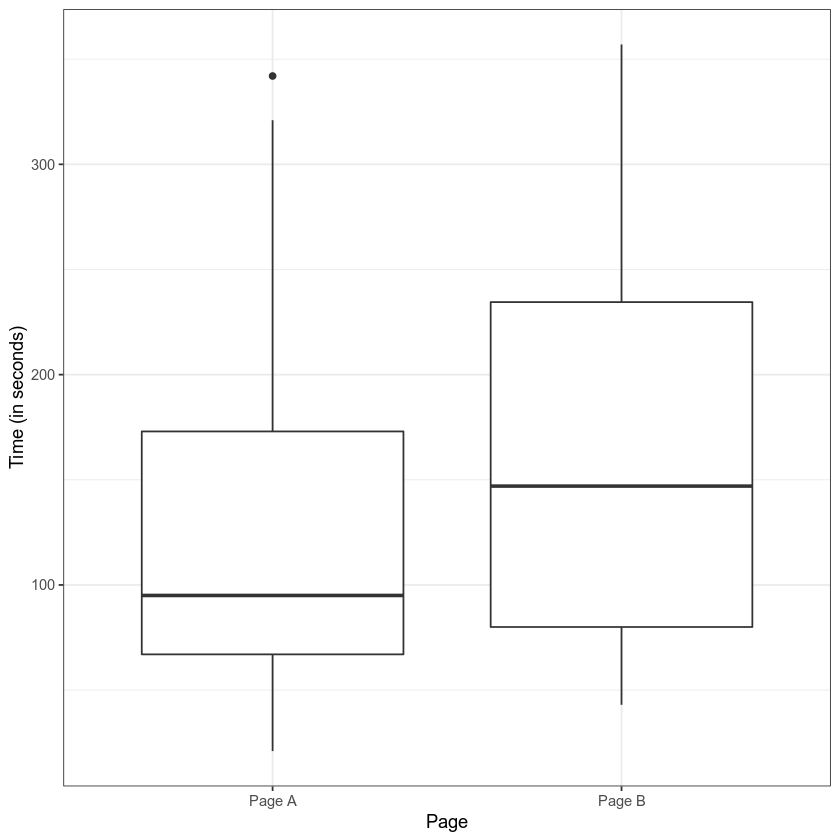
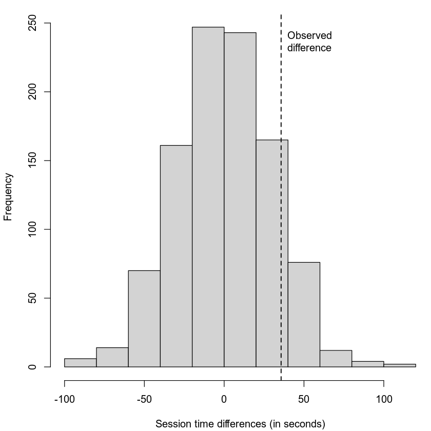
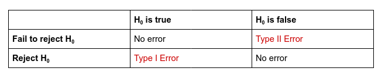

% Hypothesis Testing
% DA 101, Dr. Ladd
% Week 8

# Why Do We Need a Hypothesis?

## Humans underestimate randomness.


## Hypothesis tests protect researchers from being fooled by random chance.

# Sample vs. Population

## A **sample** is the data we actually have, some subset of all possible data.

## The **population** is the full data, the entire thing. (It's usually impossible to collect it all.)

## Hypothesis tests help us to know if the observed differences in the sample are the result of random chance.

# The Null Hypothesis and the Alternative Hypothesis

## The **Null Hypothesis** is a baseline assumption that the result is due to chance.

## The Null Hypothesis assumes *equality*.

Consider two sample groups, A and B. (Such as the male and female groups of your alcohol use data.)

In a t-test, the null hypothesis would assume that the means of A and B are *equal*, that there is no difference between them, and that any observed difference we see is the result of randomness.

## In a hypothesis test, we try to prove the null hypothesis *wrong*.

We attempt to disprove the null hypothesis by showing that the observed data **isn't** the result of randomness.

## The **Alternative Hypothesis** accounts for all possibilities that *aren't* the Null Hypothesis.

If there's a null hypothesis, there has to be an alternative hypothesis.

If the null hypothesis is that A and B are equal, then the alternative hypothesis would be that A and B are *not* equal (either smaller or bigger).

## The Alternative Hypothesis can be One- or Two-Tailed.

- One-tailed: We only care about a non-equal result in one direction, i.e. if A > B but **not** if A < B.

- Two-tailed: We care about differences in both directions, i.e. A != B but could be larger or smaller.

Different research questions lead to different alternative hypotheses.

# Let's consider some examples

## What are the Null and Alternative Hypotheses?

1. Is the median house price in Granville larger than the median price in Newark?

2. Is the mean number of mountain lions per 100 km^2 equal in North and South America?

3. NHANES reports the average starting age of smoking is 19. Is this correct, or is the true mean lower than this?

# Interpreting a Hypothesis Test

## Let's walk through an example

Say you have two web pages, Page A and Page B, and you've measured the amount of time internet users spend on each page. You're trying to decide whether to replace Page A with Page B.

## First look at the difference:



## Setting up the test

The Null Hypothesis is that: 

`mean(A) = mean(B)`

The Alternative Hypothesis is that:

`mean(B) > mean(A)` (one-tailed)

## Let's imagine reshuffling the data.

We have two clear groups: the people who saw Page A and the ones who saw Page B. But we could reshuffle this data a thousand times in a thousand different configurations, where the session times are separated into equally sized but random groups.

In the end we'd have a *distribution* of how much the means differ among a thousand random groups.

## We can compare our **observed difference** to that distribution.



## In this case, we care about how often the random differences were greater than the observed difference.

I.e., how often the values were to the right of the dotted line.

In this case, that was about 12% percent of the time. That's a lot! And that means that this observed difference isn't all that unusual.

# Statistical Significance and the P-value

## We could keep looking at graphs like these, but that's imprecise.

Instead, we can measure the probability of obtaining results as unusual as the observed result.

This probability is called the p-value!

## The p-value's formal definition:

Given a chance model that embodies the null hypothesis, the p-value is the probability of obtaining results as unusual or extreme as the observed result.

In our example, our 12% was a p-value of .12!

## .05 is a common *alpha*, or pre-determined cutoff for significance.

If the p-value is lower than .05 (5%), we can reject the null hypothesis.

If the p-value is higher than .05 (5%), we fail to reject the null hypothesis and our result could be random.

This is just a rule of thumb!

---


---

## T-Tests let you calculate a p-value for a difference in means.

In our example of two groups in our data, we could test whether their difference in means is significant using a **t-test**.

A t-test estimates the random reshuffled distributions based on a series of assumptions about what that distribution should look like. It calculates a p-value based on that "t-distribution."

Different statistical tests calculate p-values for other kinds of differences.

## All other things being equal...

- The observed difference increasing will decrease the p-value (more likely to find significance)
- The sample size increasing will decrease the p-value (more likely to find significance)
- The variability increasing will increase the p-value (less likely to find significance)

## Don't *only* consider the p-value!

Consider results that are:

- **Statistically significant and practically significant (i.e. useful)**
- Statistically significant and *not* practically significant (i.e. not useful)
- Statistically insignificant and practically significant 
- Marginally significant and practically significant

## Error in Hypothesis Testing



- Type I Error (alpha-error) is rejecting the null hypothesis when it is true.

- Type II Error (beta-error) is failing to reject the null hypothesis when it is false.

Misreading or overemphasizing the p-value can lead us to error!

# More Hypothesis Tests!

## How do we test whether the means of two groups are the same?

The two-sample t-test: (This one is review!)

```r
# First filter some data
mpg_filtered <- filter(mpg, class=="minivan"|class=="pickup")

# Then run the test
t.test(hwy~class,mpg_filtered)
```

## How do we test the mean of one variable?

The one-sample t-test:

```r
# Run the test to see if the mean of hwy
# is greater than 0.
t.test(mpg$hwy, mu=0, alternative="greater")
```

We can set the default mean (`mu`) to *any value*. Remember that the variable **must** be normally distributed.

## How do we know if a variable is normally distributed?

The Shapiro-Wilk test:

```r
shapiro.test(mpg$hwy)
```

**Important note**: the variable likely has a normal distribution if the p-value is *higher* than .05. Always compare with a histogram!

## Can we make our own normally-distributed variable?

Let's try out `rnorm()`. It takes 3 parameters: the number of observations, the mean, and the standard deviation.

```r
# A normally-distributed variable of 100 values, with mean of 5 and sd of 2
v1 <- rnorm(100, mean=5, sd=2)

# Let's look at this one:
ggplot(,aes(v1)) +
  geom_histogram()

# And we can test to make sure it's normally distributed:
shapiro.test(v1)
```

# You Try It!

## Set Up

Install and load the `palmerpenguins` dataset. Then create a filtered dataset of only the Adelie penguins.

Make sure you've got `tidyverse` imported, too.

Ask yourself: what test or function would you run? How would you run it?

## Challenges

1. Are the flipper lengths of Adelie penguins normally distributed?

2. Are the flipper lengths of Adelie penguins significantly less than 190mm?

3. Is there a significant difference in the flipper length of Adelie penguins vs. Gentoo penguins?

4. Let's create a normally distributed variable with roughly the same mean and standard deviation as the flipper length of Adelie penguins, but with twice the number of observations.


