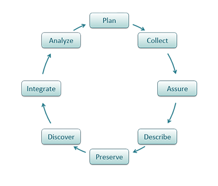

% Metadata and the Data Analysis Cycle
% DA 101, Dr. Ladd
% Week 2

[xkcd.com/2054](https://xkcd.com/2054/)

# What is Metadata?

---

---

## Metadata Can Be Descriptive.

It can help you find and understand a dataset or resource.

*Broken Earth* Examples:

- Titles: *The Fifth Season*, *The Obelisk Gate*, *The Stone Sky*
- Author: N.K. Jemisin
- Page count: 1424 pages

## Metadata Can Be Administrative.

It can help you manage a resource and tell you about how it was created.

*Broken Earth* Examples:

- Publisher: Orbit
- ISBN: 031652719X
- Ebook formats: Kindle, epub

## Metadata Can Be Structural.

It can help you understand the different parts of the dataset and their relationship.

For structured datasets, this is often column labels and their meanings.

*Broken Earth* Examples:

- Chapter titles
- Index
- Table of Contents

## Metadata has standards for interoperability.

[Dublin Core](http://dublincore.org/) -- 13 features common to digital data

[DDI: Data Documentation Initiative](https://www.ddialliance.org/) -- social, behavioral, and economic sciences

[MARC: MAchine Readable Cataloging](https://www.loc.gov/marc/) -- libraries, books & media

# The Data Analysis Cycle

## Data has its own Life Cycle...

[dataone.org](https://old.dataone.org/data-life-cycle)

## ... And So Does Data Analysis.

## There are many Data Analysis Cycles.

[R for Data Science](https://r4ds.had.co.nz/explore-intro.html)

---

[xkcd.com/2239](https://xkcd.com/2239/)
