% Network Analysis
% DA 101, Dr. Ladd
% Week 12

# What are Networks?

## Networks are made up of...

- Entities (entity = node/vertex/actor)
- Relationships (relationship = edge/link/tie)
- We'll use "nodes" and "edges"

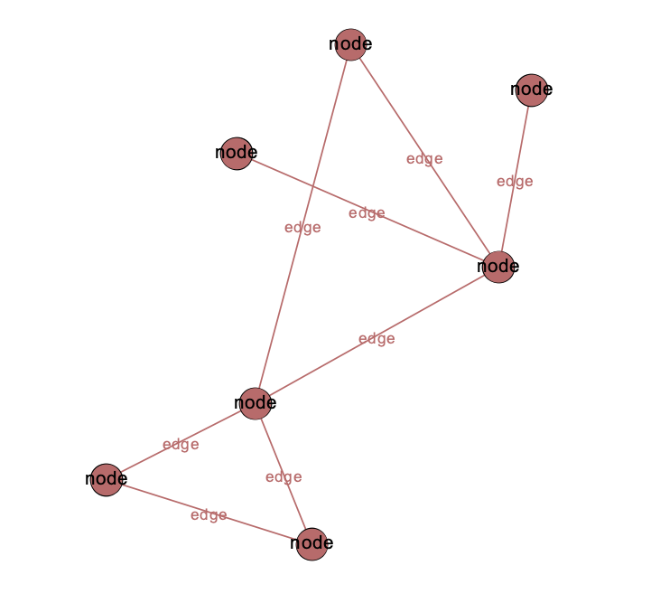{height=400px}

## Nodes and Edges have Attributes

## Node Attributes

- numerical (size)
- categorical (color)

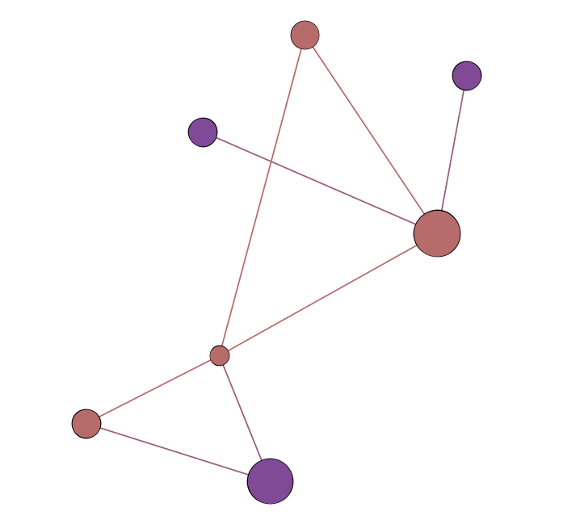{height=400px}

## Edge Attributes

## Directed and Undirected Edges

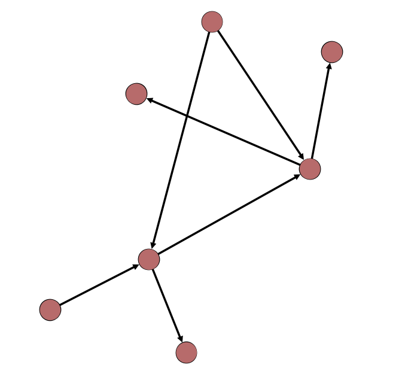{height=400px}

## Weighted and Unweighted Edges

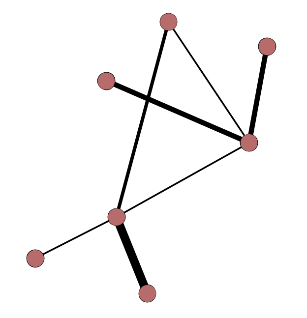{height=400px}

## Edge Types

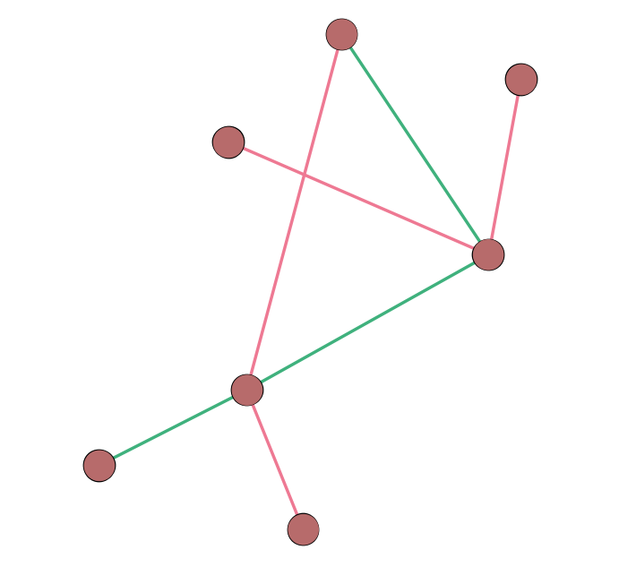{height=400px}

# Multiple Edges "in a row" Make a Path

## Path & Diameter

{height=400px}

(& Average Shortest Path Length)

# Some special kinds of nodes

## Isolates

{height=400px}

## Hubs

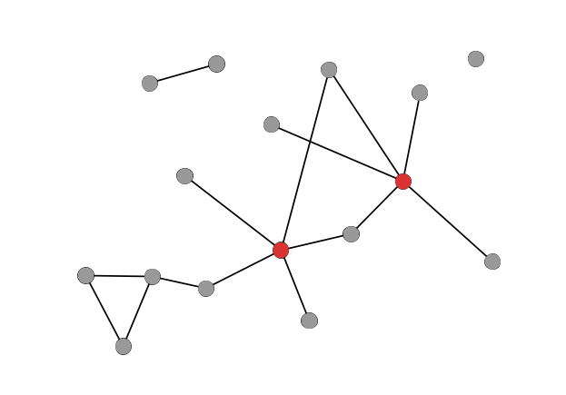{height=400px}

## Bridges

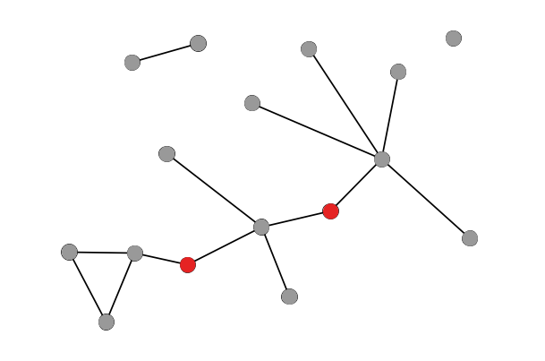{height=400px}

# Measuring a node's "importance" with centrality

## Degree

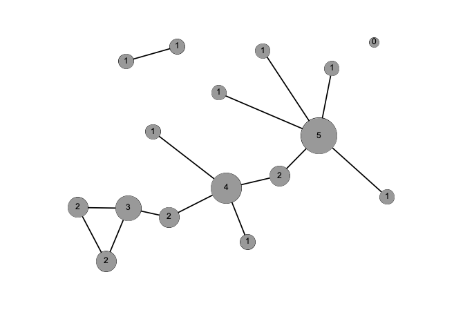{height=400px}

## Strength

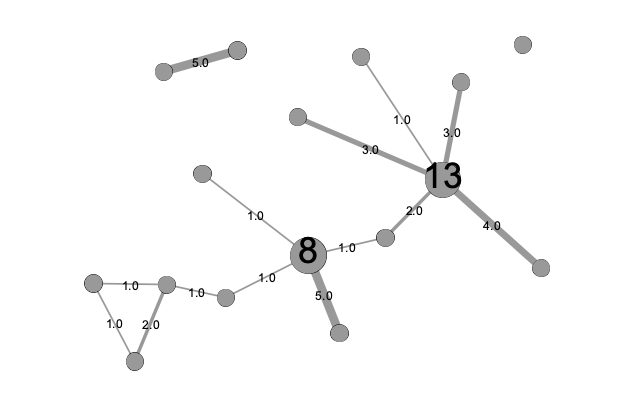{height=400px}

## Betweenness

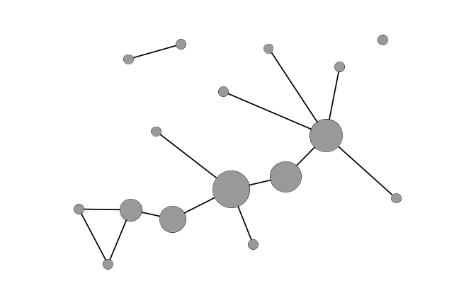{height=400px}

# Different kinds of entities or nodes

## Unipartite/unimodal

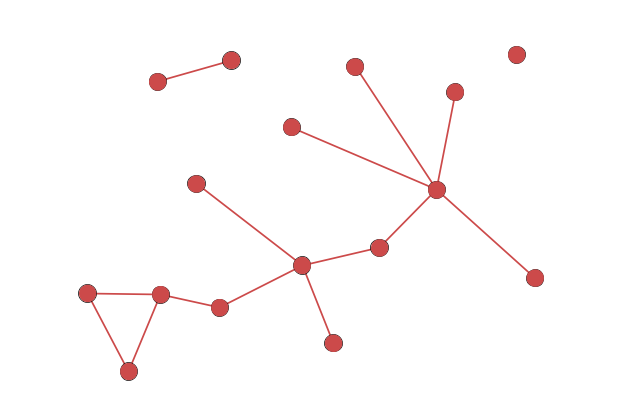{height=400px}

## Bipartite/bimodal

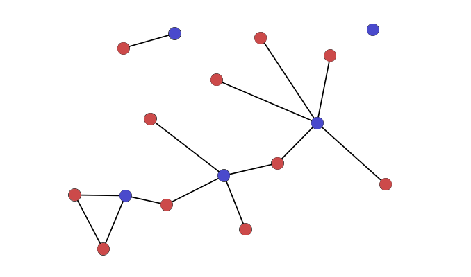{height=400px}

## Bipartite (cont.)

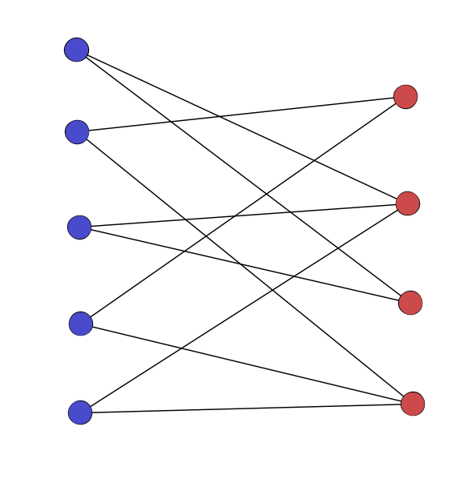{height=400px}

## Multipartite/k-partite/multimodal

{height=400px}

# Groups of nodes within a network

## Connected components

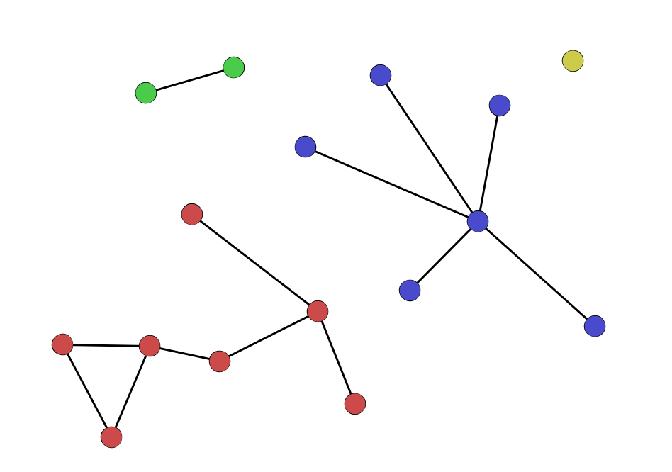{height=400px}

## Cliques and clustering

{height=400px}

## Clustering Coefficient

](network_img/clustering_coefficient.svg){height=400px}

## Communities and community detection

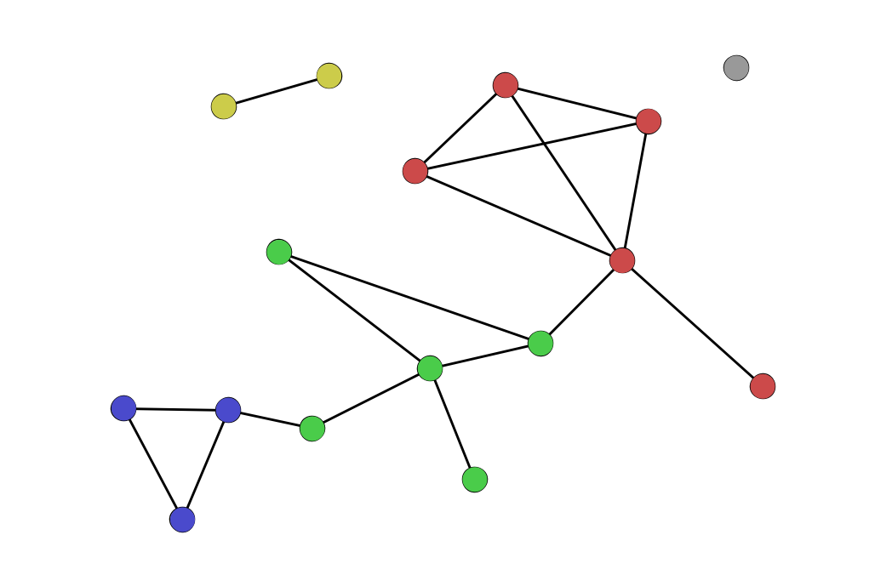{height=400px}

# Density

## A Sparse Network

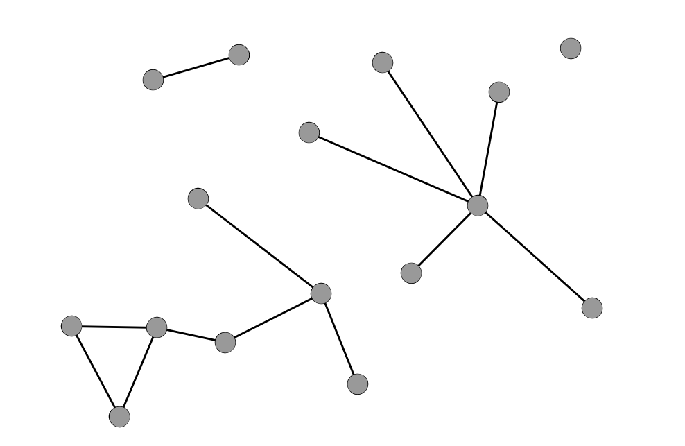{height=400px}

## A Dense Network

{height=400px}

# There are many ways to visualize a network

## Adjacency Matrix

{height=400px}

## Adjacency List

{height=300px}

- A adjacent to B,C
- B adjacent to A,C
- C adjacent to A,B

## Node-Link Diagram

{height=400px}

# Other Important Concepts

## Triadic Closure

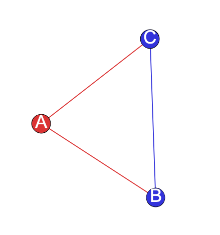{height=400px}

## Assortative mixing/Homophily

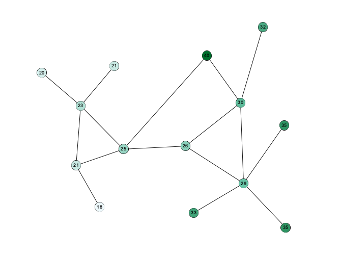{height=400px}

## Preferential Attachment

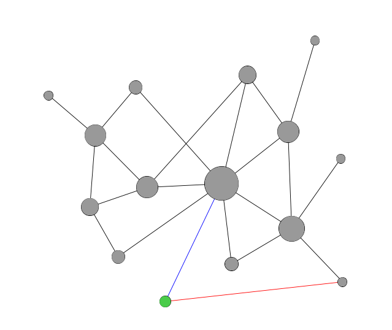{height=400px}

## Weak Ties

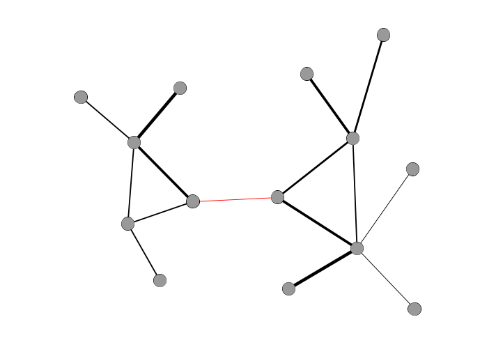{height=400px}

## Small World Network

<div style="width:50%;float:left;">
{height=400px}
</div>
<div style="width:50%;float:left;">
- low average path length
- low clustering coefficients
- degree distribution follows power law (a few large hubs)
- low diameter (usually around "six degrees")
</div>

# Working with Networks in R

## Let's start with an example.


## We'll need two new libraries.

```r
library(igraph) # Network tools and metrics

library(networkD3) # Interactive network visualizations
```

## We can download the data and load it into a "network object" with iGraph.

First, download [got-edges.csv](../data/got-edges.csv). What does this data look like?

```r
# Read in edgelist CSV
edges <- read_csv("got-edges.csv")

# Create igraph object from edgelist
G <- graph_from_data_frame(d = edges, directed = FALSE)
E(G)$weight <- E(G)$Weight #Make sure weight is labeled correctly
```

## Let's make two versions of a node-link diagram.

```r
# The default R version
plot(G)

# A better D3 version
simpleNetwork(edges, opacity=1, zoom=TRUE)
```

## We can use iGraph to calculate different metrics.


