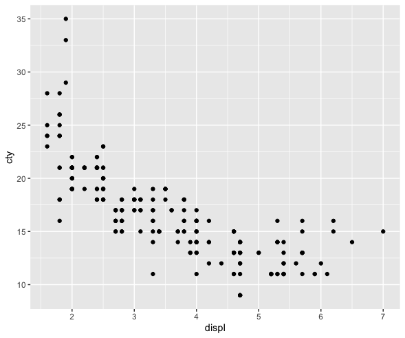

% Predictive Analytics: Regression
% DA 101, Dr. Ladd
% Week 9

# Let's start by building on our hypothesis tests.

## How do we test whether the means of two groups are the same?

The two-sample t-test: (This one is review!)

```r
# First filter some data
mpg_filtered <- filter(mpg, class=="minivan"|class=="pickup")

# Then run the test
t.test(hwy~class,mpg_filtered)
```

## How do we test the mean of one variable?

The one-sample t-test:

```r
# Run the test to see if the mean of hwy
# is greater than 0.
t.test(mpg$hwy, mu=0, alternative="greater")
```

We can set the default mean (`mu`) to *any value*. Remember that the variable **must** be normally distributed.

## How do we know if a variable is normally distributed?

The Shapiro-Wilk test:

```r
shapiro.test(mpg$hwy)
```

**Important note**: the variable likely has a normal distribution if the p-value is *higher* than .05. Always compare with a histogram!

## Can we make our own normally-distributed variable?

Let's try out `rnorm()`. It takes 3 parameters: the number of observations, the mean, and the standard deviation.

```r
# A normally-distributed variable of 100 values, with mean of 5 and sd of 2
v1 <- rnorm(100, mean=5, sd=2)

# Let's look at this one:
ggplot(,aes(v1)) +
  geom_histogram()

# And we can test to make sure it's normally distributed:
shapiro.test(v1)
```

# You Try It!

## Set Up

Install and load the `palmerpenguins` dataset. Then create a filtered dataset of only the Adelie penguins.

Make sure you've got `tidyverse` imported, too.

Ask yourself: what test or function would you run? How would you run it?

## Challenges

1. Are the flipper lengths of Adelie penguins normally distributed?

2. Are the flipper lengths of Adelie penguins significantly less than 190mm?

3. Is there a significant difference in the flipper length of Adelie penguins vs. Gentoo penguins?

4. Let's create a normally distributed variable with roughly the same mean and standard deviation as the flipper length of Adelie penguins, but with twice the number of observations.

# Understanding Correlation

## Let's think about how we look at the relationship of two variables.

## Remember the Pearson correlation coefficient?

```r
cor(mpg$displ,mpg$cty)
```

This tells us the strength of the correlation, but is this correlation *statistically significant*?

## There's a test for this, too!

The correlation test:

```r
cor.test(mpg$displ,mpg$cty)
```

Now we know the variables are correlated, and we know that this correlation is statistically significant. But we can learn more about the *nature* of the relationship...

## But first, more challenges!

1. What is the correlation coefficient between bill length and flipper length in the `penguins` dataset?

2. Is this correlation statistically significant?

3. Let's verify our result visually, with a scatter plot! Bonus: How would we see if species matters? And how would we visualize the trend?

# Linear Regression

## We can use correlation coefficients and correlation tests to learn the *strength* of a relationship, but how do we learn the *nature* of a relationship?

## Questions we might want to answer with regression:

- Does x influence y?
- Is crop growth rate improved by fertilizer?
- Do taller sprinters run faster?

## Linear prediction models, also called regression models, help us to answer these kind of questions, which explore *relationships*.

## A **prediction model** analyzes data that the researcher (*you!*) supplies, and calculates numerical coefficients to help with prediction.

## Linear regression is just one type of model!

# How does linear regression work?

## For many kinds of data, it is possible to "fit" a line to a set of data points. 

## That line represents the connection between an ________ (x-axis) and a ________ (y-axis) variable.

## And in this case, the ______________ variable is a function of the ________________ variable. 

## To define independent and dependent variables, you need to *use your human brain*.

Come up with a *rationale* for why you think they would be related.

## This does *not* mean that x causes y! A regression can't show that.

It's *not* a good idea to just try to regress any set of variables together.

**Correlation does not mean causation!!**

# Calculating simple linear regression

## $Y=mX+b$

Can also be written as: $Y=b_{1}X+b_{0}$

## $Y=mX+b$

$Y$ is your dependent variable.

$X$ is your independent variable.

## $Y=mX+b$

Two coefficients:

$m$ (or $b_{1}$) describes the *slope* of the line (and its direction).

$b$ (or $b_{0}$) describes the height of the line when $X$ is 0. This is called the y-intercept or simply the intercept.

## We can provide 2 numeric variables ($X$ and $Y$), and R will calculate the $m$ and $b$ values.

This is what it means to "fit" a linear model.

## In theory, if you know any $m$ and $b$, you can use any new X value to *predict* a Y value. Wow!

# Linear regression in R

## Always start with exploratory analysis.

Do you have good reason to believe that a linear regression or predictive model would help? Is there a relationship between variables that's worth learning about?

```r
library(tidyverse) # Gets us both dplyr and ggplot!

# Let's make a scatter plot of engine displacement and
# city fuel efficiency, in the mpg dataset.

ggplot(mpg, aes(displ, cty)) + 
  geom_point()
```

---



## It looks like there might be a linear relationship!

We can see a general trend: as engine size goes up, fuel efficiency goes down. Now we're ready to try modeling this relationship.

## Beware!


## For statistical modeling in R, we can use `tidymodels`.

```r
# In the console only:
install.packages("tidymodels")

# In your .R file or RMarkdown:
library(tidymodels)
```

## First we choose our model, then we fit it to our data, then we can summarize or predict.

```r
# Save everything in a variable called "regression"
regression <- linear_reg() %>% # Choose the linear regression model
  set_engine("lm") %>% # Set linear model as our engine
  fit(cty~displ, data = mpg) # Fit to our data
```

## We have several ways of looking at the results

```r
tidy(regression) # See the slope and intercept (m and b)
glance(regression) # See R2 and other important stats

# This is the main one:
summary(regression$fit) # See a summary of everything
```

# Interpreting Linear Regression

## Running summary() throws a lot at you! Let's go through it step-by-step.

## "Call" shows the formula you used.

```
Call:
stats::lm(formula = cty ~ displ, data = data)
```

This would help if you didn't have the original code.

## Residuals are the differences between the actual observed values and the ones the model predicted.

```
Residuals:
    Min      1Q  Median      3Q     Max 
-6.3109 -1.4695 -0.2566  1.1087 14.0064 
```

<small>Think of these as the "errors" that the modeling method produced. If the residuals are symmetrically distributed with the median close to zero, the model may fit the data well.</small>

## Coefficients show an estimate for the intercept ($b$) and the slope ($m$).

```
Coefficients:
            Estimate Std. Error t value Pr(>|t|)    
(Intercept)  25.9915     0.4821   53.91   <2e-16 ***
displ        -2.6305     0.1302  -20.20   <2e-16 ***
---
Signif. codes:  0 ‘***’ 0.001 ‘**’ 0.01 ‘*’ 0.05 ‘.’ 0.1 ‘ ’ 1
```

We get estimates and a p-value (`Pr(>|t|)`) for each coefficient. The coefficients tell us the *nature* of the relationship and whether it's "significant."

---

With a slope of `-2.6305` and a very low p-value, this linear regression provides evidence that as engine displacment increases, fuel efficiency decreases!

For every additional unit of engine displacement, the expected fuel efficiency decreases by 2.6305.

*Be careful not to imply that there is a direct causal link, especially without more evidence or studies.*

## $R^{2}$ shows the amount (proportion) of variation in $Y$ that is accounted for by $X$.

```
Multiple R-squared:  0.6376,	Adjusted R-squared:  0.6361 
F-statistic: 408.2 on 1 and 232 DF,  p-value: < 2.2e-16
```

$R^{2}$ ranges from 0 to 1. If it were 1, the variables would make a straight line. If it were 0, the x variable wouldn't predict the y variable at all.

---

In this example, $R^{2}=0.6376$, so engine displacement accounts for about 64% of the variation in fuel efficiency.

There's no rule for what makes an $R^{2}$ "good." Consider the context and purpose of your analysis!

In an analysis of ecology or human behavior (very unpredictable) an R2 of 0.20 or 0.30, might be considered good. In an analysis predicting mechanical repairs, or recovery from medical procedures, an R2 of 0.60 or 0.70 might be considered very poor. 

## The $R^{2}$ is also accompanied by a p-value.

```
Multiple R-squared:  0.6376,	Adjusted R-squared:  0.6361 
F-statistic: 408.2 on 1 and 232 DF,  p-value: < 2.2e-16
```

This is a significance test for the probability of observing a result this extreme, assuming the true $R^{2}$ is 0. Here the p-value is very small: there's a *statistically significant* relationship.

# Visualize and Validate Your Model

## Look at the original data, but with a line of best fit.

Also called a "regression line."

```r
ggplot(mpg, aes(displ,cty)) +
  geom_point() +
  stat_smooth(method="lm")
```

---


## Create a Q-Q plot of the residuals.

The quantile-quantile plot shows how closely your residuals follow a normal distribution.

```r
res <- rstandard(regression$fit) # First get the residuals

# Then make the plot
ggplot(,aes(sample=res)) +
  geom_qq() +
  geom_qq_line() +
  labs(y="Standardized Residuals", x="Normal Scores")
```

---


