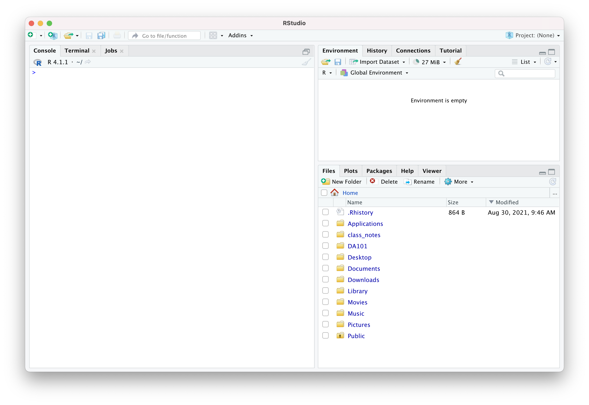

% R Basics
% DA 101, Dr. Ladd
% Week 2

# [A Pirate's Favorite Programming Language](https://postlight.com/insights/a-pirates-favorite-programming-language)

# What's the Difference Between R and RStudio?

## R is a programming *language*.

It's the code you write.

`somedata <- read.csv("yourfile.csv")`

## RStudio is a desktop program.

When you "Open R", you're really opening RStudio.



## Almost all RStudio commands have equivalent R functions.

You set the Working Directory to tell R which folder/directory to use on your computer. You can:

1. Navigate to the desired folder in the Files section, then click "More > Set as Working Directory" ***or***
2. Type  
`setwd('path/to/working_directory')`  
into the console or a .r file.

# R has its own syntax.

## Variables store information

```
myvar <- 5

myvar
```

## You Try It!

Create a variable called "newVar" that is equal to the value of five plus seven. Then display your variable to see what its value is.

## Use descriptive variable names, and avoid spaces.

```
i_use_snake_case
otherPeopleUseCamelCase
some.people.use.periods
And_aFew.People_RENOUNCEconvention
```

## Add frequent comments to explain what your code does.

Comments in R begin with a `#` symbol.

```
# This variable contains a continuous value
some_variable <- 2.5
```

## Variables have types.

- String or Character: a piece of text (ex. `"five"`)
- Integer: a discrete numerical value (ex. `5`)
- Float or Double: a continuous numerical value (ex. `5.0`)

```
stringvar <- "five"

typeof(stringvar)
```

## You can put reusable code in R scripts.

These are ".r" files, and you can create them by clicking the `+` icon at the top left of the RStudio window and selecting "R Script".

Always comment your code so you can remember things when you come back later!

# Data Frames store rectangular data.

## Usually we create a data frame by reading a csv.

```
GarlicMustardData <- read.csv("GarlicMustardData.csv")
```

## There are standard functions and syntax for working with data frames.

```
# Browse a data frame with the view function.
View(GarlicMustardData)

# Get summary statistics for every column in a data frame.
summary(GarlicMustardData)

# Access a specific column of a data frame.
GarlicMustardData$AvgAdultHeight
```

## You Try It!

Import the "GarlicMustardData.csv" file. Get a summary for all of the data, and then get a summary for *just the AvgNLeaves column*. Bonus: find the type of that column.

n.b. Remember to make sure your working directory is set to the right place!

# Functions and Libraries store reusable code.

## A function is a command that runs based on some *input* or *parameter*.

R has many built-in functions.

```
# Some functions give a number result
mean(GarlicMustardData$AvgNFruits, na.rm=TRUE)

# Other functions graph things
plot(GarlicMustardData$AvgAdultHeight,GarlicMustardData$bio12)
```

Functions can do just about anything: calculate values, create graphs, transform data, etc.

## You can create functions like you create variables.

```
myfunction <- function(arg1, arg2, ... ){
statements
return(object)
}
```

A real example:

```
get_last_value <- function(some_list){
  return(some_list[length(some_list)])
}
```

## Libraries/Packages contain reusable functions made by someone else.

```
# Install libraries only once
install.packages("packagename")

# Load a library every time you run your code
library(packagename)
```

## You Try It!

Install and load the `tidyverse` package. Then install and load the `swirl` package. Can you tell what these two packages do?

# Now you're ready to try some things on your own!

## In-Class Exercise

1. Create a new .R file
1. Install and import the ggplot2 library
2. Make sure to add comments as you go!
2. Find the `mpg` dataset, view it, and get a summary
3. Select a column from `mpg` and get its mean and median
4. Create a basic scatterplot of two `mpg` variables (columns)

## All this and more in [Chapter 4](https://r4ds.had.co.nz/workflow-basics.html) of our textbook!
