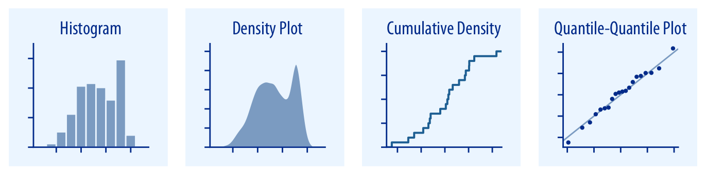

% Visualizing Data
% DA 101, Dr. Ladd
% Week 4


## Some Good Resources on Visualization

- Claus Wilke's [Fundamentals of Data Visualzation](https://clauswilke.com/dataviz/) (The illustrations in this slide show come from here!)
- [Chapter 3](https://r4ds.had.co.nz/data-visualisation.html) of our course textbook, R for Data Science

# Why Do We Visualize Data?

## Visualization can be *exploratory*, *explanatory*, or both!

## Exploratory viz helps *us* (the researchers or analysts) understand the data.

## Explanatory viz helps *others* (the clients or audience) understand our analysis.

## Many visualizations do both of these things at once!

# What Does Visualization Help Us to See?

## Viz Can Help Us See *Amounts*.


- Variable types: 1 categorical and 1 numerical
- Common graph types: Bar plot (Don't confuse the dot plot with the scatter plot!)

## Plot *Amounts* With Multiple Categories.


- Variable types: 2 or more categorical, 1 numerical
- Common graph types: Grouped or stacked bar, heat map

## Viz Can Help Us See *Distributions*.



- Variable type: 1 continuous (numerical)
- Common graph types: Histograms, Density plots, Q-Q plots

## *Distributions* with Multiple Categories.


- Variable types: 1 continuous (numerical), 1 categorical
- Common graph types: Box plots, Violin plots

## You Try It!

Look at the documentation for the `mpg` data set. What visualization type would you use to compare the counts of each type of car? Which variables would you use, and what *kind* of variables are they? Jot down your answers.

## Viz Can Help Us See *Proportions*.


- Variable types: 1 numerical, 1 categorical
- Common graph types: Pie chart, Bar plot

## Viz Can Help Us See *Relationships*.


- Variable types: 2 continuous (numerical), (3 in a bubble chart)
- Common graph types: Scatter plot, Bubble Chart, Hex bins, Density contours

## You Try It!

Look at the `mpg` documentation again. What visualization type would you use to compare the distribution of city fuel efficiency among different drive trains? Which variables would you use, and what *kind* of variables are they? Jot down your answers.

## Viz Helps Us See *Time*, *Location*, *Uncertainty*...


More on these viz types in future lessons!

# Make Great Viz with `ggplot2`

## Import on its own or with `tidyverse`

```r
library(ggplot2)
```

or 

```r
library(tidyverse)
```

## The `ggplot()` function takes two arguments, data and a mapping

```r
ggplot(data = YourDataFrame, mapping = aes(x = FirstVariable, y = SecondVariable))
```

You can use this with or without the argument names `data =` and `mapping =`.

## Aesthetic mapping defines what variables should be used.

```r
ggplot(data = YourDataFrame, mapping = aes(x = FirstVariable, y = SecondVariable, color = ThirdVariable))
```

In this example, `FirstVariable` becomes the x-axis and `SecondVariable` becomes the y-axis. You can also add a mapping for `color`.

## Add different layers to your viz with the `+` sign.

```r
ggplot(data = YourDataFrame, mapping = aes(x = FirstVariable, y = SecondVariable)) +
	geom_point() +
	geom_smooth() +
	facet_wrap(~ThirdVariable)
```

The `+` works sort of like the `%>%` in `dplyr`.

## Create different shapes and plot types with `geom` layers.

- `geom_point()`
- `geom_bar()`
- `geom_boxplot()`
- `geom_histogram()`
- and on and on!

You can put aesthetic mappings inside geom layers if you prefer!

## You Try It!

Create a plot to compare the price of a diamond to its weight using `ggplot`'s built-in diamonds dataset. Then create the same plot but show color as the quality of the cut.

## Group your data by category with `facet` layers.

`facet_wrap(~x)`: Use a single categorical variable.

`facet_grid(x ~ y)`: Use two categorical variables.

```r
ggplot(YourDataFrame, aes(x = FirstVariable, y = SecondVariable)) +
	geom_point() +
	facet_wrap(~ThirdVariable)
```

## Statistically transform your data with `stat` layers.

- `stat_count()` counts up categories and works behind the scenes in `geom_bar()`.
- `stat_bin()` creates countable segments of continuous data and works behind the scenes in `geom_histogram()`.
- `stat_summary()` lets you summarize any aspect of your data.

## Use `?` to get more information about *any* ggplot layer.

```r
?facet_wrap
?geom_histogram
?stat_bin
```

## You Try It!

Create a plot showing the distribution of weight in the diamonds dataset. Then show the distributions according to each color of diamond. Finally, change the size of the bins in each distribution to show more detail.

