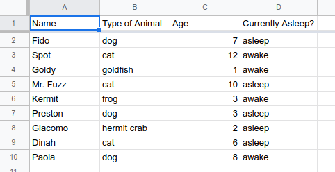

% What Is Data?
% DA 101, Dr. Ladd
% Week 1

# Data's Many Forms

## Data Is Something That People *Make*.

## Data Can Be Rectangular (Tabular).

## Data Can be Structured (Relational).

## Data has Rows (Observations) and Columns (Features).

# Data Can Be Messy or Tidy.

## One Row for Each Observation.

## One Column for Each Type of Information.

## One Value in Every Cell.

## Avoid Visual "Data" (i.e. colors in a spreadsheet).

## Use Good Null Values.

## Save Data in Plain Text Files (CSV or TSV).

# Types of Data

## Data Can Be Quantitative (Numerical).

- Discrete (integers or whole numbers)
- Continuous (any value, including decimals)

## Data Can Be Qualitative (Categorical).

- Ordinal (categories have an order or hierarchy)
- Nominal (categories don't have an order)
